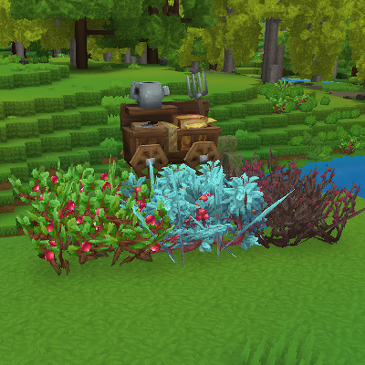
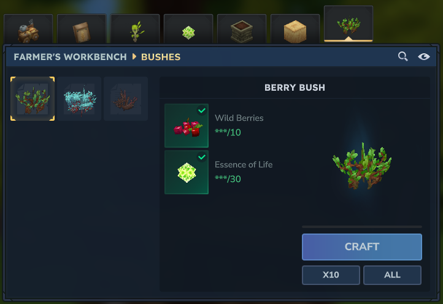

  

<h1 align="center">Craftable Berry Bushes (Hytale Mod)</h1>

  
  

  A Hytale mod that adds craftable berry bushes to the Farmer’s Workbench.

***

A new **“Bushes”** category is added to the Farmer’s Workbench, allowing you to craft:

* Berry Bush
* Wet Berry Bush
* Winter Berry Bush

All bushes are crafted using **Wild Berries** and **Essence of Life**.

***

### **Unlock Requirements**
*   Tier 3: Berry Bush
*   Tier 4: Wet Berry Bush
*   Tier 5: Winter Berry Bush

### **Why This Mod?**
Berry bushes can normally be obtained by trading with the Rootling Merchant, but:

*   The available quantity is limited.
*   Breaking a placed bush does not return the bush item.
*   Misplacing bushes can be frustrating and costly.

This mod provides a balanced alternative by allowing players to craft berry bushes themselves through the Farmer’s Workbench.

If you feel that crafting costs, unlock tiers, or overall balance should be adjusted, please let me know.